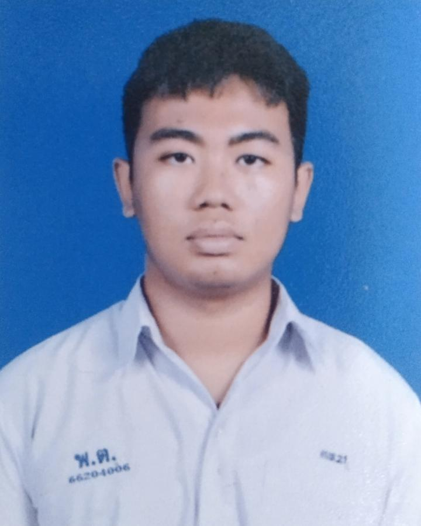
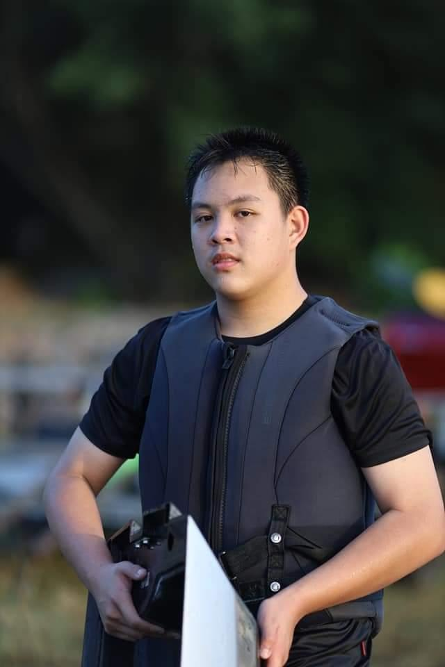
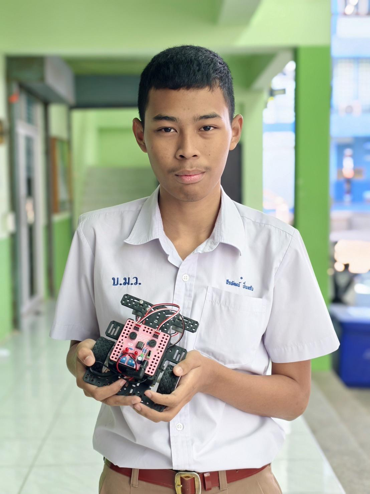
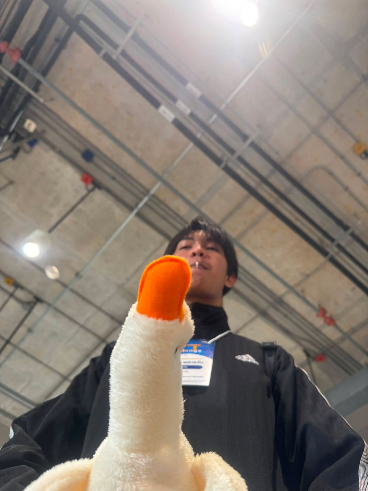
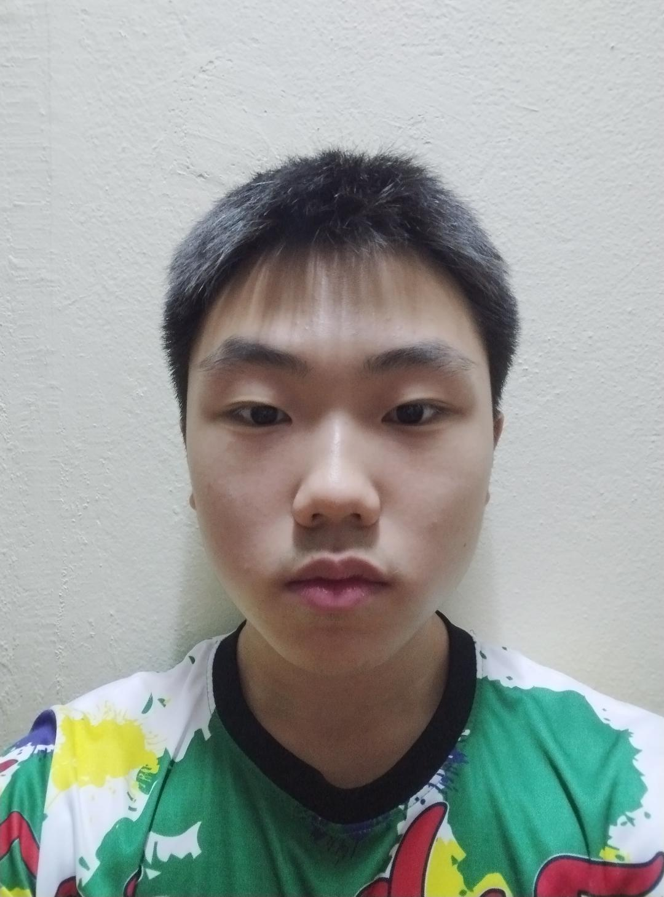

# Group Name #
Our group name is "KuayTeowMooTun" (ก๋วยเตี๋ยวหมูตุ๋น). We get this name from vote in github issues named "โหวดชื่อ team". Everyone can submit their own team's name idea, And we'll vote use trumb emoji in the comment. The idea of this name's "Wonderfully nonsensical". Asburdity can make people become closer and feel friendly not too stressed.

# 😌Nitipon Sripaopan Profile | 
## NickName : Peet  |  Student ID : 69130500031 |

## Personal Profile
* **Name :** Nitipon Sripaopan
* **NickName :** Peet
* **Date of Birth :** 19 AUGUST 2007

## Education
* **King Mongkut's University of Technology Thonburi (KMUTT)** — Bachelor's Degree (Currently Studying)
* **Phrapathom wittiyarai**

## Hobby 
**What do you like to do in your free time and why?**
— He like playing AnyGame .
— He do the homework that's still left.

## Goals & Passion  
**What are your goals and passions?**
—Graduate in 4 years with good grades, get a high-paying job..
— My friend inspiration is to graduate, get a job, and earn enough money to afford everything him want..

## Quotation
**What is your motto and what does it mean?**
—"I will never give up on something I haven't even tried."

## Strength
**What do you think are your strengths and how can you develop and build upon them?**
— Peet is gaining experience and continuously improving himself
— paint model Because it's something him good at

## Weakness
**What do you think are your weaknesses, what problems do you face nowadays, and how can you handle them?**
— Waste money on unnecessary stuff
— Not confident in myself
— Not good at approaching people

# Extra Question
**What brings you the most happiness these days?**
— Women.

**Which childhood event do you think shaped you into the person you are today?**
— Custom PC by myself.

## Social Media
**Instagram :**[Peet_nd](https://www.instagram.com/peet_nd/)
**GitHub :**[NZXNosk](https://github.com/NZXNosk)

## The interviewer and first impression
**The Interview**
* **Kamjondet Srisombut**   

## **Interview ID**
* **69130500003**

## **Interview's impression**  
* **He's the chill guy. Who can fit with another people easily. He always give the unexpected idea for the team. If possible, I would like to work with him again.**
---
---
 
 
 
 
# 👨‍💻 KAMJONDET SRISOMBUT Profile | 
## NickName : Boat  |  Student ID : 69130500003 |

## Personal Profile
* **Name :** Kamjondet Srisombut  
* **NickName :** Boat
* **Date of Birth :** 9 October 2007 

## Education
* **King Mongkut's University of Technology Thonburi (KMUTT)** — Bachelor's Degree (Currently Studying)
* **Chetupon Commercial College** — Vocational Certificate
* **Amnuaywit School** — Kindergarten, Primary School, Junior High School

## Hobby :smile:
**What do you like to do in your free time and why?**
— He like playing the guitar + singing because it is relaxing.
— He like drawing because it feels like a reflection of my own emotions.

## Goals & Passion  
**What are your goals and passions?**
— He current goal is to study well enough not to get an 'F' in the Design Thinking course. Him long-term goal is to go out to work, support himself and  him parents, and earn enough for a comfortable living.
— The inspiration that makes him want to wake up and leave the house to live my life is probably the lack of monotony in it. He feel like none of him passing days are exactly the same, and he want to learn from everything that comes into him life. He enjoy every subject him study. He've never felt like skipping any class. If possible, He want to live happily in every phase of him life.

## Quotation
**What is your motto and what does it mean?**
— Anicca, Dukkha, Anatta (Everything is uncertain, everything causes suffering, everything is non-self—we do not truly own anything).

## Strength
**What do you think are your strengths and how can you develop and build upon them?**
— Easygoing/chill to work with
— Well-organized
— Not lazy
— Plays music beautifully

## Weakness
**What do you think are your weaknesses, what problems do you face nowadays, and how can you handle them?**
— Overthinking
— Thinking too much
— Thinking until I make myself sick
— Taking other people's words to heart
— Hard to reach on holidays

## 🫰🏼Do you think AI will take our jobs? 
— I don't think so, as long as we aren't lazy today.

## Freelancing vs. Hackathons for experience?*
— My friends are split 50/50 because each offers a different kind of experience.

## Social Media 
**Instagram :**[kamjon.sris](https://www.instagram.com/kamjon.sris/)
**GitHub :**[CATDBB101](https://github.com/CatDBB101) 
**Portfolio :**[Portfolio](https://my-portfolio-55daa.web.app/)

## The interviewer and first impression
**The Interview**
* **Nitipon Sripaopan**   

## **Interview ID**
* **69130500031**

## **Interview's impression**  
* **I think he's a reliable person.**

---
---
 
 
 
 

# 🐼 Vanich viriyakerkgraikul Profile |
## NickName : simon  |  Student ID : 69130500057 |

## Personal Profile
* **Name :** Vanich viriyakerkgraikul
* **NickName :** simon
* **Date of Birth :** 04 december 2007

## Education
* **King Mongkut's University of Technology Thonburi  (KMUTT) "** — Bachelor's Degree (Currently Studying)
* **sakaeoschool** — Secondary school
* **assumption college sriracha** — Primary school

## Hobby
**What do you like to do in your free time and why?**
- I like to listen to live streams on Channel 9arm because during the live streams, I learn new information and news about tech, such as 4 days ago, OpenAI's AI escaped from the test area and hacked a real company, and it was also a zero-day vulnerability hack.  

## Goals & Passion  
**What are your goals and passions?**
- I want to work in cyber security and I want to have my own business where I can work on my own. My inspiration to work in cyber security started when I was a kid, when I thought it looked cool and was very important. When I grew up, I saw news about various criminals, which further emphasized that there is a real problem that is clearly visible, and how important and interesting our job is. As for the business, my inspiration is that if my business can operate without me having to supervise it all the time, I can take a break and take my family on a trip.

## Quotation
**What is your motto and what does it mean?**
- "There is no change where there is no action."

## Strength
**What do you think are your strengths and how can you develop and build upon them?**
- Dare to learn new things. Think using reason rather than emotion. Dare to learn new skills from friends you've just met. And have empathy for others. In real work, we can use this part to help us continue to work on our own development. Learn from others on the team, work with the team, and lead the team to success together.

## Weakness
**What do you think are your weaknesses, what problems do you face nowadays, and how can you handle them?**
- I'm  who likes to compare myself to others quite a lot, to the point that sometimes it puts too much pressure on me. I like to keep thinking and doing things over and over again, wondering if it's okay, what other people will think. This can be fixed by taking time to accept myself more and more. As we grow up, we encounter different things, and I believe that what we are experiencing now will diminish and eventually disappear.

## What music genre do you like to listen to, and why do you like listening to this genre?  
- Alternative Rock, Modern Rock, and J-Rock—all of these make me feel excited and remind me that the bad parts of the day don't define the whole day; there are still fun things waiting for me.

## When choosing to buy a product or service, what do you pay the most attention to?
- i buy a product and i look at the quality the most because it's something we'll see and touch throughout its use.

## Social Media
**Facebook :**[Simon Eiei](https://www.facebook.com/share/1Jh2WFszkY/) 
**Instagram :**[kchinoz_x](https://www.instagram.com/kchinoz_x?igsh=MThob3k2amF0cXFrNg==) 
**GitHub :**[simon36060](https://github.com/simon36060) 

## The interviewer and first impression
 **The Interview**
* **Teerapat Pinkeaw**  

 **Interview ID**
* **69130500027**

 **interview's impression**  
* **I feel that my friends are easy to talk to, but there may still be some unfamiliarity because we've just met. I may feel nervous during the interview.**

---
---
 
 
 
 

# 🕷️ TEERAPAT PINKEAW Profile | 
## NickName : Boat  |  Student ID : 69130500027 |

## Personal Profile
* **Name :** Teerapat Pinkeaw  
* **NickName :** Boat  
* **Date of Birth :** 3 November 2007

## Education
* **King Mongkut's University of Technology Thonburi (KMUTT)** — Bachelor's Degree (Currently Studying)
* **Watbangkhuntainnok School** — Primary School
* **Bangmodwittaya** —   Junior High School

## Hobby 
**What do you like to do in your free time and why?**
* **I watch TikTok because I can view a variety of content in a short amount of time, which helps me relax**

## Goals & Passion  
**What are your goals and aspirations?**
* **My goal is to become a developer or freelancer who can work from home and learn various skills to create games as a hobby. My reason is simply that I enjoy it; if what I want to convey and the people who use my games feel the same way, that's enough to make me happy. In short, my goal is to work and earn money while staying at home, having time with my family, and living a happy and fulfilling life**

## Quotation
**What is your motto? What does it mean?**
* **Discipline is the key to success. The meaning is straightforward: with discipline, one can continuously learn and improve**

## Strength
**What are your strengths, and what are they that you can develop further?**
* **Having a good ability to perceive others' feelings allows you to understand what people need or feel, enabling you to find the right moment to talk or persuade them in the direction you want. This can be used in business, or even simply to listen to someone's problems and help them**

## Weakness
**What are your weaknesses? What problems are you facing today? What can you do about them?**
* **Overthinking is a problem that causes anxiety or keeps dwelling on thoughts for extended periods, wasting time and increasing stress. So, what can be done? Focus on what you can control and utilize, such as viewing things from multiple perspectives, anticipating potential problems or consequences, making decisions more informed, and using worry less to create more thoughtful plans**

## Social Media
**Facebook :** <a href="https://www.facebook.com/share/193sv5efq1/">Boat RH</a> 
**Instagram:**<a href="https://www.instagram.com/boat_rh?igsh=dXhuNnAxbm1md2p6"> boat_rh</a> 
**GitHub :**<a href="https://github.com/BoatRH"> BoatRH</a> 

## How has your two weeks of studying at SIT
* **What impressed me most was the garden/nature, because I have allergies to air pollutants, so I appreciated that this place had spots where I could breathe more comfortably. Regarding academics, I feel like I had to adjust a lot from high school, but the teachers are good in many subjects, and the social environment is great. I feel good knowing many talented friends, which allows me to learn from those around me. However, I also feel like I sometimes need to try harder to keep up**

## Did anything happen last week that made you feel good?
* **Last week wasn't particularly gratifying, but there were a few things that did, like getting the item I wanted from a gacha pull in a game.**

## The interviewer and first impression
**The Interview**
* **Vanich Viriyakerkgraikul**   

 **Interview ID**
* **69130500057**

 **interview's impression**  
* **It feels good to have met Boat and to understand his thoughts better. We may not be close yet because this is our first time talking, but after learning about his story and thoughts, I believe that in future projects or when we meet again, Boat will be a good friend, someone I can trust, and with whom I can have meaningful conversations**

---
---
 
 
 
 

# 👨‍💻 WATCHARAPHAT PLANGWAN Profile 
## NickName : Focus  |  Student ID : 69130500056 |

## Personal Profile
* **Name :** Mr. Watcharaphat Plangwan
* **NickName :** Focus
* **Student ID :** 69130500056
* **Date of Birth :** 13 August 2550

## Education
* **King Mongkut's University of Technology Thonburi (KMUTT)** — Bachelor's degree (currently studying)
* **Thungsukhla Pittaya "Krungthai Anukroh" School** — Secondary education
* **Wat Chuk Kacho School** — Primary education

## Hobby
**What do you like to do in your free time and why?**
* I like playing basketball because it allows me to exercise and move my body. It also gives me a chance to go out, play with friends, and meet new people. Plus, basketball is a fun sport that I can enjoy playing continuously.

## Goals & Passion
**What are your goals and inspiration?**
* My goal is to work in a field that matches my skills and interests. 
  My inspiration comes from a senior I know who works in this industry and has recommended career paths that offer great opportunities for growth.

## Quotation
**What is your motto and what does it mean?**
* "All success comes from effort." This meaning stems from my personal thoughts and experiences, 
  having once failed due to a lack of attention and effort, so I have taken this as a valuable lesson.

## Strength
**What do you think your strengths are, and how will you develop them further?**
* I enjoy developing myself based on my aptitudes. I am very passionate about computers, mobile devices, and technology, so I actively learn about these areas. These skills can be leveraged to build a future career in the IT field.

## Weakness
**What weaknesses or current problems do you have, and how are you addressing them?**
* I am quite weak in English. Currently, I lack vocabulary; while I can listen and understand, I struggle to communicate effectively. 
  I am now trying to study more, use English for communication more often, and incorporate it into my daily activities.

## Career Path & Future Career Preparation Assessment
**Reflections on attitudes toward planning future career paths**
* Roughly speaking, I plan to study hard, participate in competitions frequently, and accumulate diverse experiences. This includes keeping up with new skills, staying updated with trends, and never falling behind. These efforts should help prepare me for an uncertain future job market.

## Expectations from studying at SIT?
**What do you expect from studying at SIT?**
* I expect to elevate my programming and system development skills from a basic level to a professional level through a Project-based Learning curriculum.
* I expect to develop problem-solving skills, teamwork, and coordination abilities that will be beneficial for my future career.

## Social Media 🛜
* **Facebook :** <a href="https://www.facebook.com/watcharaphat.plangwan/">Watcharaphat Plangwan</a>
* **Instagram :** <a href="https://www.instagram.com/foforyou_/?hl=en">Foforyou_</a>
* **GitHub :** <a href="https://github.com/watcharaphatpw-ai">Watcharaphatpw-ai</a>

## The interviewer and first impression

**The Interviewer :**
 Wongsathorn Preechanarit

**Interview ID :**
69130500049

**interview's impression**
* Focus comes across as someone who is highly dedicated to his studies, yet remains very approachable, friendly, and easygoing. He demonstrates solid technical knowledge and carries himself with confidence, showing clear potential as a natural leader. It was a pleasure interviewing him because he communicates his ideas clearly and maintains a great balance between professionalism and a relaxed personality.
---
---
 
 
 
 

# 💪Wongsathorn Preechanaruet Profile
## NickName : Joe  |  Student ID : 69130500049 |

## Personal Profile
**Name :** Wongsathorn Preechanaruet 
**Nickname :** Joe 
**Student ID:** 69130500049 
**Date of Birth :** 29 March 2551
## Education
* **King Mongkut's University of Technology Thonburi (KMUTT)** — Bachelor's Degree (Currently Studying)
* **Bangpakok Wittayakom School** — Secondary Education
* **Panyasak School** — Primary Education 
 * **Favorite Color:** Green

## Hobby
 **What do you like to do in your free time and why?** 
* I like playing sports, going to the gym, and running because it is a form of exercise that allows me to move my body, build strength, and feel refreshed.

## Goals & Passion
 **Why did you decide to study IT here, and what is the main reason that makes you still feel it was the right choice (or unexpectedly wrong)?** 
* I decided to study here because I once attended the Open House event and really liked the atmosphere and the teaching style, which had modern equipment. After studying the curriculum, I felt it was knowledge that could be applied to real-world work in the future.

## Career Path Preparation
**Why do you think studying only in the classroom is not enough for IT students today, and why do we need to seek out extra projects outside of class?** 
* Since AI is increasingly being used in the workplace nowadays, I believe it is necessary to learn more on my own. Trying out projects outside the classroom opens up opportunities to experiment with new things, and I believe that hands-on practice will help me gain knowledge and skills that are much more applicable than just studying from textbooks.

## Quotation
**What is your personal motto and what does it mean?** 
* "The best investment you can make is in yourself" 
(The best investment is investing in yourself, because knowledge and skills will stay with you forever.)

## Strength
 **What do you think are your strengths, and how can you develop and leverage them further?** 
* I am a fast learner and have a lot of physical energy. I can tackle work or various activities well, and I am ready to use this enthusiasm for learning new things in the IT field.

## Weakness
 **What do you think are your weaknesses, and how can you fix them?** 
* My English skills are not very strong yet, so I need to try harder to practice, read, and use it more to support my studies and future career.

## Social Media 🛜
* **Instagram :** <a href="https://www.instagram.com/joe_wgt/"> joe_wgt </a>
* **GitHub :** <a href="https://github.com/jowongsathorn"> jowongsathorn </a> 

## The Interviewer and First Impression
**The Interview :** 
Watcharaphat Plangwan   
**Interview ID :** 
69130500056  
**Interviewer's Impression**  
* Joe's friend seems really down-to-earth, nice, and easy to talk to. They also come across as very disciplined and responsible. Beyond their warm and approachable nature, they consistently demonstrate impressive self-motivation and reliability. They handle every commitment with high dedication while maintaining a positive, collaborative spirit that uplifts everyone in the room.

---
---
 
 
 
 