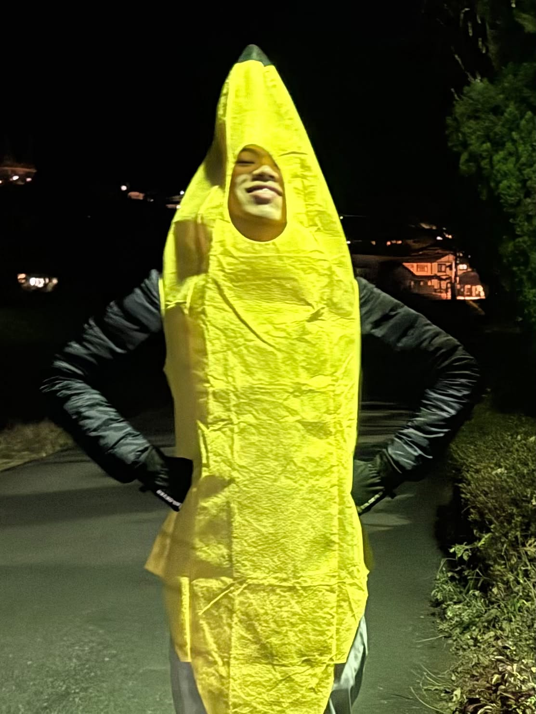

# Nitipon Sripaopan Profile | 
## NickName : Peet  |  Student ID : 69130500031 |

## Personal Profile
* **Name :** Nitipon Sripaopan
* **NickName :** Peet
* **Date of Birth :** 19 AUGUST 2007

## Education
* **King Mongkut's University of Technology Thonburi (KMUTT)** — Bachelor's Degree (Currently Studying)
* **Phrapathom wittiyarai**

## Hobby 
**What do you like to do in your free time and why?**
— He like playing AnyGame .
— He do the homework that's still left.

## Goals & Passion  
**What are your goals and passions?**
—Graduate in 4 years with good grades, get a high-paying job..
— My friend inspiration is to graduate, get a job, and earn enough money to afford everything him want..

## Quotation
**What is your motto and what does it mean?**
—"I will never give up on something I haven't even tried."

## Strength
**What do you think are your strengths and how can you develop and build upon them?**
— Peet is gaining experience and continuously improving himself
— paint model Because it's something him good at

## Weakness
**What do you think are your weaknesses, what problems do you face nowadays, and how can you handle them?**
— Waste money on unnecessary stuff
— Not confident in myself
— Not good at approaching people

# Extra Question
**What brings you the most happiness these days?**
— Women.

**Which childhood event do you think shaped you into the person you are today?**
— Custom PC by myself.

## Social Media
**Instagram :**[Peet_nd](https://www.instagram.com/peet_nd/)
**GitHub :**[NZXNosk](https://github.com/NZXNosk)

## The interviewer and first impression
**The Interview**
* **Kamjondet Srisombut**   

##**Interview ID**
* **69130500003**

##**Interview's impression**  
* **He's the chill guy. Who can fit with another people easily. He always give the unexpected idea for the team. If possible, I would like to work with him again.**