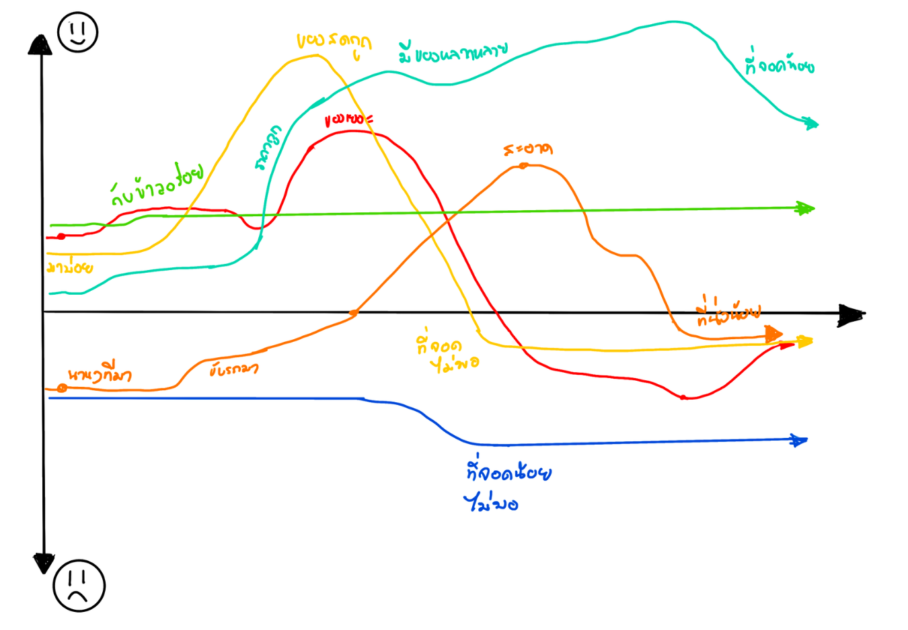
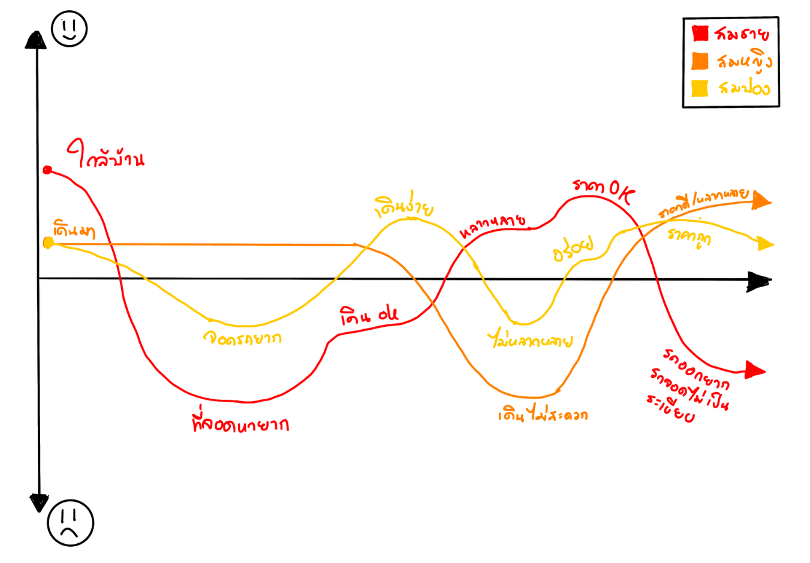

---

# Interview Script

>คำถามที่ตั้งขึ้นมาเพื่อสอบถามผู้ใช้งานในพื้นที่ **ตลาดทุ่งครุ (61)** และ **ตลาดทุ่งครุใหม่** เพื่อค้นหาปัญหาและแนวทางในการแก้ไขปัญหาต่างๆ จากประสบการณ์จริงของผู้ใช้

---

---
---

# Interview Results
สรุปผลจากการสัมภาษณ์และวิเคราะห์ความรู้สึก ความคิดของผู้ใช้งานในพื้นที่ตลาด เพื่อนำไปต่อยอดในการวิเคราะห์พฤติกรรม

---

## Interviewed Personal  
* **กรุณาคลิ้กที่รูปเพื่อดูรายละเอียด**

| Personal 1 | Personal 2 | Personal 3 |
| :---: | :---: | :---: |
|  |  |  |

| Personal 4 | Personal 5 | Personal 6 |
| :---: | :---: | :---: |
|  |  |  |
---
---

# User Persona

---

# Journey Maps

| Journey Map: Each User | Journey Map: Each Persona |
| :---: | :---: |
|  |  |

---

# Analysis Tools

| Say / Do / Think / Feel | What / How / Why |
| :---: | :---: |
|  |  |

---

# Initial POV & Insights

> **1. คุณสมชาย (ผู้ใช้รถยนต์ส่วนตัว)**
> * **Need:** ต้องการความสะดวกในการนำรถเข้า-ออกจากตลาด
> * **Insight:** เสียเวลาในการ **จอดรถและวนหาที่จอด** นานเกินไป เนื่องจากพื้นที่จอดรถไม่เพียงพอ

> **2. คุณสมหญิง (ผู้ใช้บริการเดินซื้อของ)**
> * **Need:** ต้องการความสบายและความสะดวกสบายขณะเดินเลือกซื้อสินค้า
> * **Insight:** รู้สึก **อึดอัดและร้อนอบอ้าว** ระหว่างเดิน ทำให้ประสบการณ์การเดินตลาดลดลง

> **3. คุณสมปอง (ผู้บริโภคทั่วไป)**
> * **Need:** ต้องการความหลากหลายของสินค้าและร้านอาหาร
> * **Insight:** มักจะเจอและรับประทาน **อาหารหรือสินค้าเดิมๆ** จึงอยากให้มีตัวเลือกใหม่ๆ ที่หลากหลายมากขึ้น