---

# Interview Script

>คำถามที่ตั้งขึ้นมาเพื่อสอบถามผู้ใช้งานในพื้นที่ **ตลาดทุ่งครุ (61)** และ **ตลาดทุ่งครุใหม่** เพื่อค้นหาปัญหาและแนวทางในการแก้ไขปัญหาต่างๆ จากประสบการณ์จริงของผู้ใช้

---

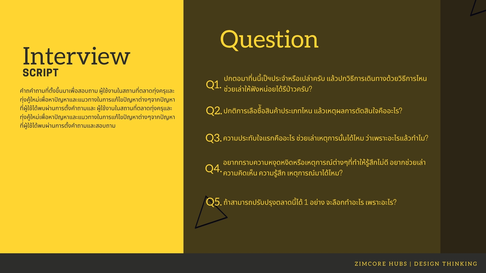
---
---

# Interview Results
สรุปผลจากการสัมภาษณ์และวิเคราะห์ความรู้สึก ความคิดของผู้ใช้งานในพื้นที่ตลาด เพื่อนำไปต่อยอดในการวิเคราะห์พฤติกรรม

---

## Interviewed Personal  
* **กรุณาคลิ้กที่รูปเพื่อดูรายละเอียด**

| Personal 1 | Personal 2 | Personal 3 |
| :---: | :---: | :---: |
| 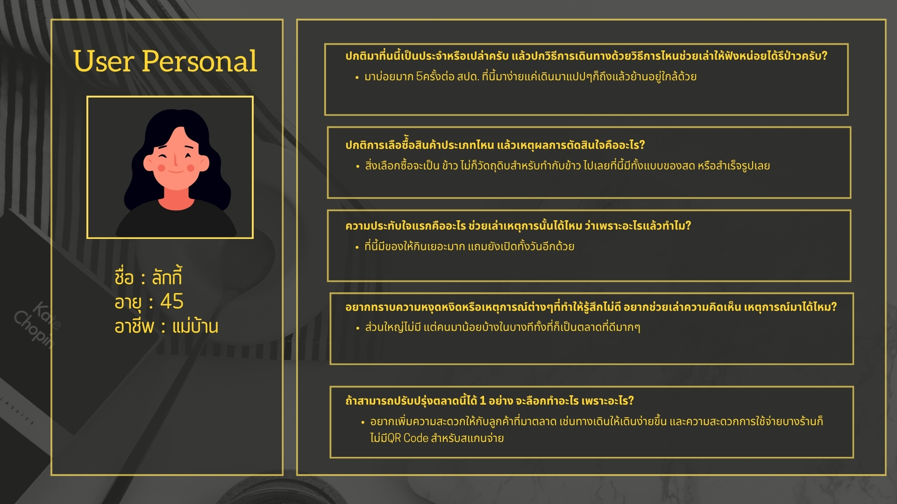 | 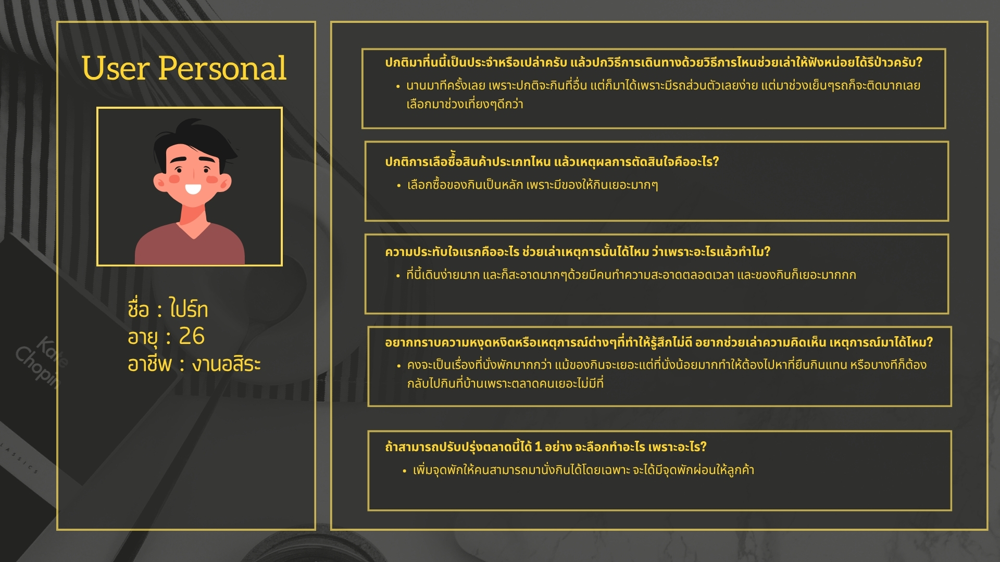 | 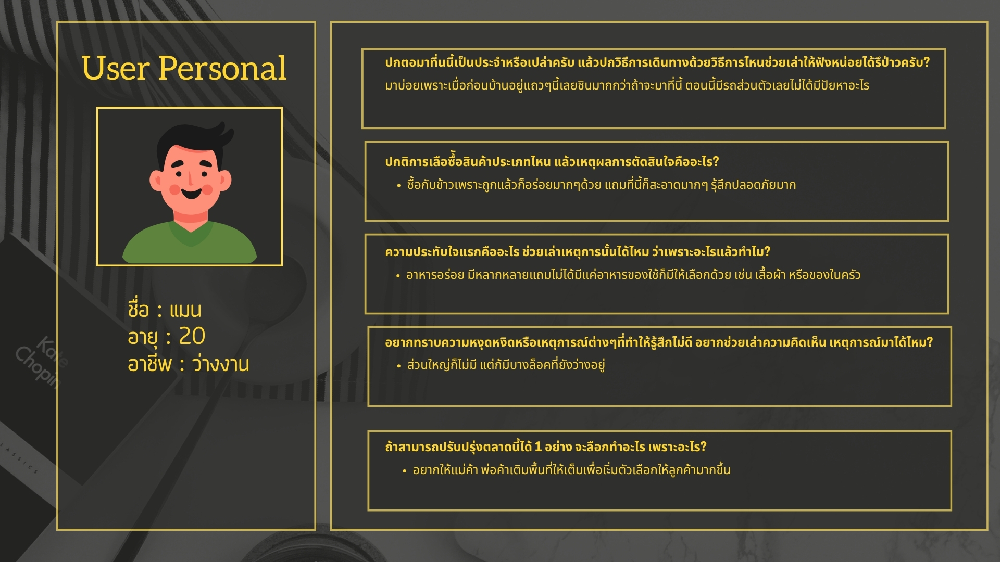 |

| Personal 4 | Personal 5 | Personal 6 |
| :---: | :---: | :---: |
| 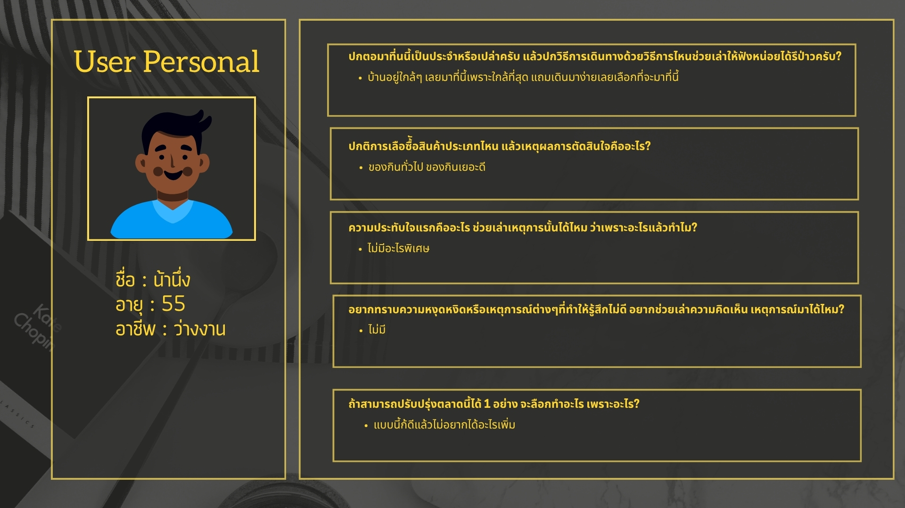 | 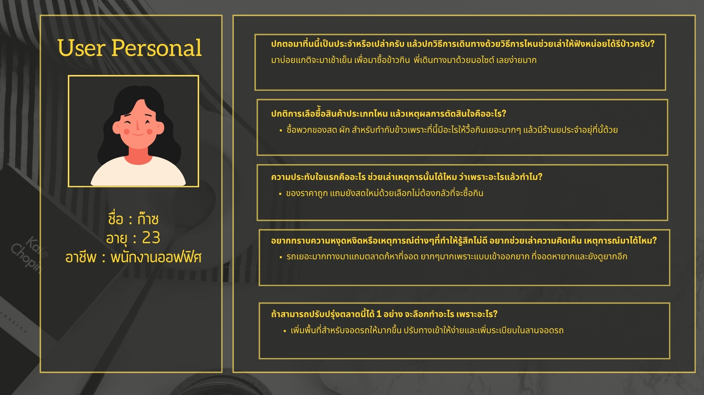 | 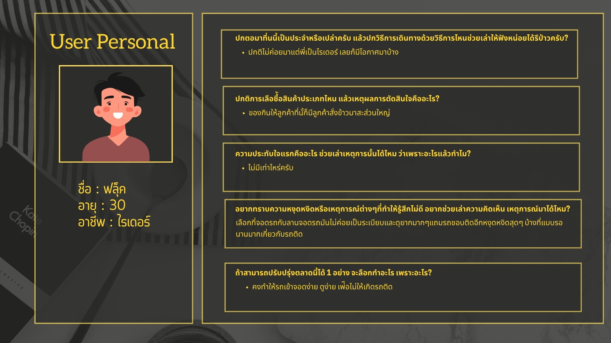 |
---
---

# User Persona

---

# Journey Maps

| Journey Map: Each User | Journey Map: Each Persona |
| :---: | :---: |
| 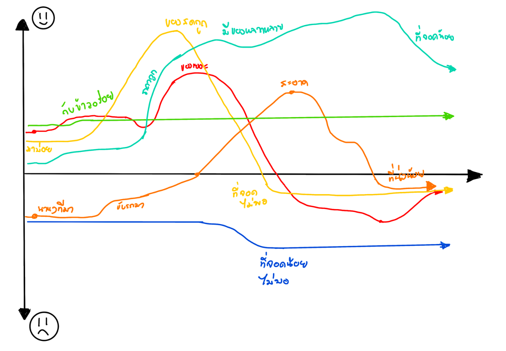 | 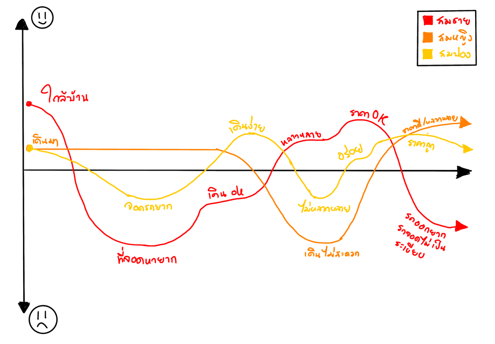 |

---

# Analysis Tools

| Say / Do / Think / Feel | What / How / Why |
| :---: | :---: |
| 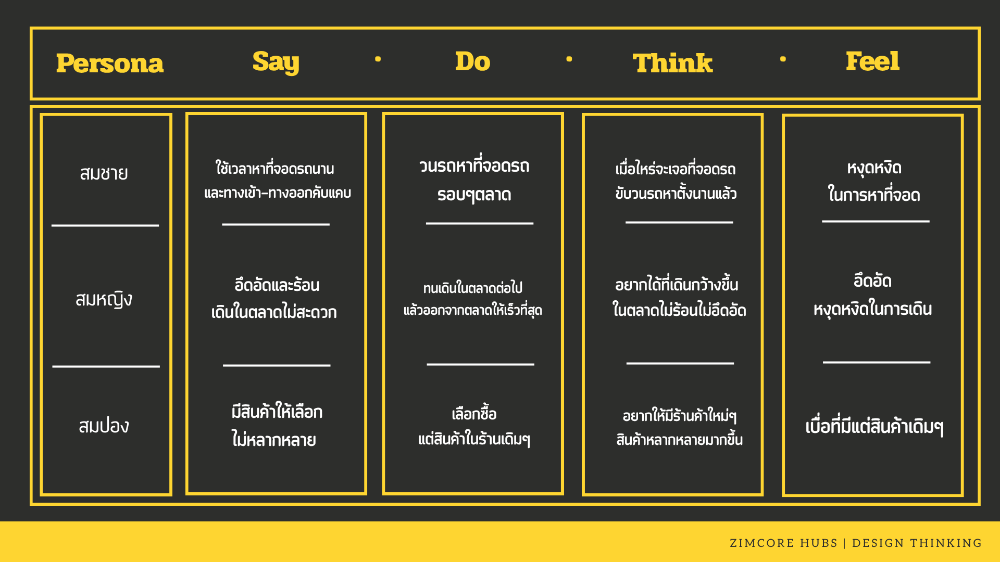 | 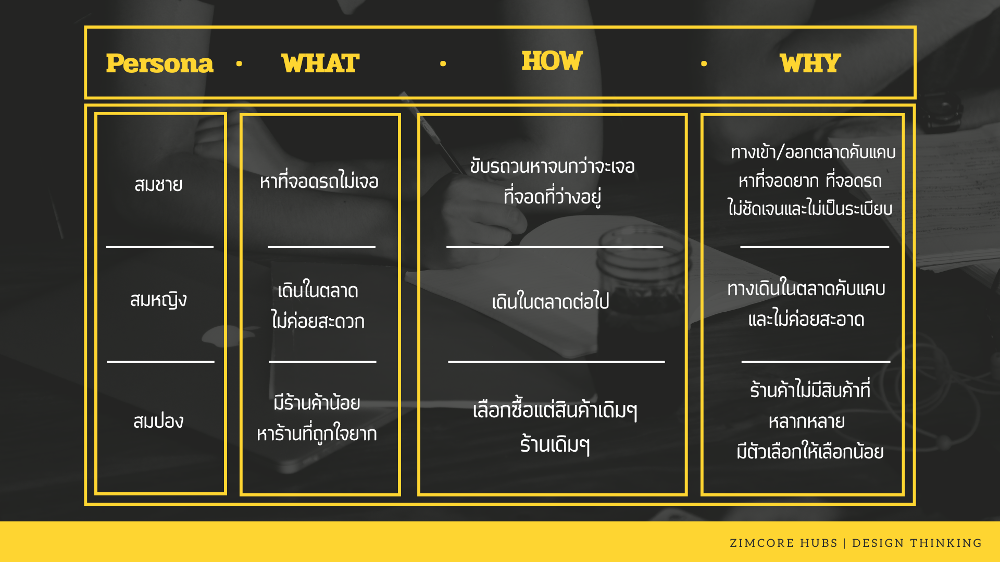 |

---

# Initial POV & Insights

> **1. คุณสมชาย (ผู้ใช้รถยนต์ส่วนตัว)**
> * **Need:** ต้องการความสะดวกในการนำรถเข้า-ออกจากตลาด
> * **Insight:** เสียเวลาในการ **จอดรถและวนหาที่จอด** นานเกินไป เนื่องจากพื้นที่จอดรถไม่เพียงพอ

> **2. คุณสมหญิง (ผู้ใช้บริการเดินซื้อของ)**
> * **Need:** ต้องการความสบายและความสะดวกสบายขณะเดินเลือกซื้อสินค้า
> * **Insight:** รู้สึก **อึดอัดและร้อนอบอ้าว** ระหว่างเดิน ทำให้ประสบการณ์การเดินตลาดลดลง

> **3. คุณสมปอง (ผู้บริโภคทั่วไป)**
> * **Need:** ต้องการความหลากหลายของสินค้าและร้านอาหาร
> * **Insight:** มักจะเจอและรับประทาน **อาหารหรือสินค้าเดิมๆ** จึงอยากให้มีตัวเลือกใหม่ๆ ที่หลากหลายมากขึ้น

___

#  Point of View (POV)

>ผู้ใช้ตลาดที่เดินทางมาด้วยรถยนต์และจักรยานยนต์ ต้องการจุดจอดรถและเส้นทางการเข้า-ออกตลาดที่ชัดเจนเพราะในตอนนี้มีความไม่ชัดเจนของพื้นที่จอดรถและการจัดการเส้นทางที่ไม่เป็นระบบ ทำให้ผู้ใช้ตลาดต้องเสียเวลาในการวนหาที่จอดรถ 

___
___ 
  
      

# IDEATE ARTIFACTS 
>ช่วงการระดมความคิดเสนอไอเดีย เเละ จัดอันดับไอเดียที่น่าสนใจ จากสมาชิกภายนในกลุ่มที่มีไอเดียที่ต่างกัน
---
 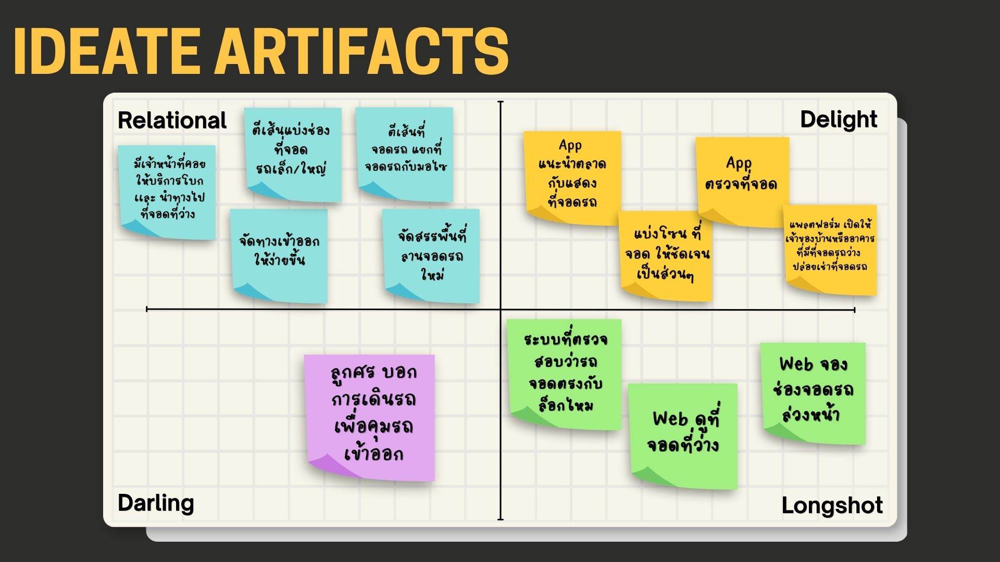 
---
 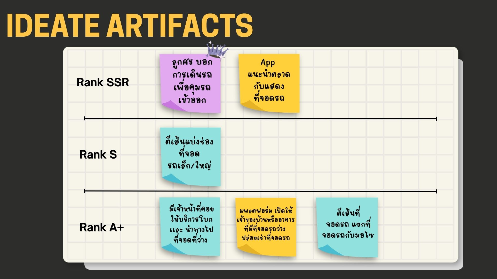 

___

# PROTOTYPE 
______________________________
# PROTOTYPE-Car Park Structure
**ที่จอดรถเดิม** ที่จอดรถใหญ่กับเล็กปนกัน + ทางเข้าและออกปนกัน

**prototype version 1** แยกที่จอดรถเล็กกับรถใหญ่ให้ชัดเจน

**prototype version 2** จัดการทางเดินรถเข้า/ออก ระหว่างรถเล็กรถใหญ่แยกกัน

**prototype version 2** ทำ graphic ให้ดูง่ายขึ้น จะรายละเอียดที่จอดรถ และ ทางเดินรถตาม feedback ที่ comment มา

____________________________________
# PROTOTYPE-Information Board
 จากการพัฒนาต้นแบบ (Prototype) หลัก ได้มีการออกแบบส่วนเสริมในรูปแบบของป้ายประชาสัมพันธ์ (Information Board)   โดยมีวัตถุประสงค์เพื่อแสดงข้อมูลตำแหน่งที่จอดรถ แผนผังเส้นทางสัญจรภายในตลาด และช่องทางการติดต่อสำหรับแจ้งปัญหาต่างๆ  

| Information Board | Signage Locations |
| :---: | :---: |
|  |  |

# Test Script
____________________________________
- ? เมื่อดูแผนที่นี้ครั้งแรก คุณมองออกทันทีไหมว่าส่วนไหนคือทางรถวิ่ง ส่วนไหนคือที่จอดรถ หรือทางเข้าทางออกรถอยู่ตรงไหน?
- ? สี สัญลักษณ์ และลูกศรที่ใช้ในแผนที่ ชัดเจนและทำให้เข้าใจทิศทางได้ง่ายหรือไม่? (มีจุดไหนที่ต้องเพ่งหรือสับสนไหม?)
- ? ทิศทางทางเข้า-ออก และการเดินรถแบบใหม่ในแผนที่ ดูแล้วสมเหตุสมผลและน่าจะช่วยลดปัญหารถติดในตลาดได้ไหม?
- ? บริเวณที่จัดไว้สำหรับจอดแวะรับ-ส่ง หรือโหลดของ ดูเพียงพอและอยู่ในจุดที่ใช้งานได้จริงหรือไม่?
- ? เมื่อเทียบกับสถานการณ์ปัจจุบันของตลาด แผนผังแบบใหม่นี้ตอบโจทย์หรือแก้ปัญหาที่คุณเจอเป็นประจำได้มากน้อยแค่ไหน?
- ? มีส่วนไหนในแผนที่นี้ที่คุณคิดว่าถ้าเอาไปใช้งานจริงแล้วคนน่าจะแหกกฎ หรือใช้งานผิดวัตถุประสงค์มากที่สุด?
____________________________________

# Test Result
____________________________________
### สมชาย (อายุ 22, อาชีพนักศึกษา)
**เป้าหมาย:** ความสะดวกในการจอดรถ

1. **การมองแผนที่ครั้งแรก:** มองออกครับ โครงสร้างแยกสัดส่วนค่อนข้างชัดเจนว่าตรงไหนคือถนน ตรงไหนคือช่องจอดรถ แต่ต้องดูว่าตอนตีเส้นจริงจะแบ่งช่องจอดรถยนต์กับมอเตอร์ไซค์แยกกันชัดเจนแค่ไหน
2. **ความชัดเจนของสัญลักษณ์:** ลูกศรกับสีดูเป็นเหตุเป็นผลดีครับ เข้าใจง่ายตามหลักจราจรทั่วไป ไม่ได้ซับซ้อนอะไร
3. **การแก้ปัญหารถติด:** ดูสมเหตุสมผลครับ ถ้าบังคับรถให้เดินรถทางเดียว (One-way) ตามลูกศรได้จริง รถจะไม่บล็อกกันเองตามทางแยก น่าจะช่วยระบายรถได้ดีขึ้น
4. **จุดแวะรับ-ส่ง:** ถือว่ามีประโยชน์ครับ ถ้ามีจุดโหลดของชัดเจน รถส่งของหรือรถที่มารับคนจะได้ไม่ต้องจอดขวางเลนหลัก ทำให้ผมขับวนหาที่จอดได้ลื่นไหลขึ้น
5. **การตอบโจทย์:** ตอบโจทย์ผมมากครับ เพราะเป้าหมายหลักเวลามาตลาดของผมคือต้องการความสะดวกในการจอดรถแผนผังนี้ดูจะช่วยลดเวลาวนหาที่จอดลงไปได้เยอะ
6. **จุดที่คนน่าจะแหกกฎ:** ตรงจุดแวะรับ-ส่งครับ ผมเดาว่าต้องมีคนเนียน "จอดแช่" หรือ "จอดรอ" จนเต็ม ทำให้รถที่ต้องการแวะรับส่งจริงๆ เข้ามาใช้พื้นที่ไม่ได้

---

### สมหญิง (อายุ 40, อาชีพแม่บ้าน)
**เป้าหมาย:** อยากเดินและใช้จ่ายได้สะดวก

1. **การมองแผนที่ครั้งแรก:** ป้าพอมองออกจ้ะ เห็นทางเดินกับทางรถแยกกันก็อุ่นใจขึ้น แต่อยากให้เน้นสีตรงทางคนเดินให้สว่างๆ หรือชัดกว่านี้หน่อยจะได้ดูปลอดภัย
2. **ความชัดเจนของสัญลักษณ์:** สีสันพอไหวจ้ะ แต่ป้าว่าสัญลักษณ์บางจุดอาจจะเล็กไปนิดนึง ถ้าเป็นคนมีอายุมาดูอาจจะต้องเพ่งหน่อยนะ
3. **การแก้ปัญหารถติด:** น่าจะช่วยได้เยอะเลยจ้ะ ปกติป้ามาตลาดแล้วปวดหัวกับรถที่ขับสวนกันไปมา ถ้าจัดระเบียบได้แบบนี้ รถก็น่าจะไม่ติดขัดจนลามมาถึงทางคนเดิน
4. **จุดแวะรับ-ส่ง:** ตรงนี้ป้าชอบมากเลยจ้ะ บางทีป้าซื้อของสดมาหนักๆ จะได้นัดให้แฟนหรือลูกขับรถมารอรับตรงจุดนี้ได้เลย ไม่ต้องหิ้วพะรุงพะรังเดินไปไกลๆ
5. **การตอบโจทย์:** ตรงใจป้าเลยจ้ะ เพราะเป้าหมายหลักป้าคืออยากเดินและใช้จ่ายได้สะดวกถ้าจัดโซนทางเดินกับทางรถขาดจากกัน ป้าก็ไม่ต้องคอยระแวงหลังว่าจะมีรถมาเฉี่ยวตอนเลือกของ
6. **จุดที่คนน่าจะแหกกฎ:** ป้าว่ามอเตอร์ไซค์นี่แหละตัวดีเลย ชอบขี่ขึ้นมาลัดเลาะบนทางคนเดิน หรือไม่ก็จอดรถล้ำเส้นเข้ามาในเขตของคนเดินจ้ะ

---

### สมปอง (อายุ 20, อาชีพนักศึกษา)
**เป้าหมาย:** อยากได้ความหลากหลายมากขึ้น

1. **การมองแผนที่ครั้งแรก:** มองออกครับ แยกโซนชัดเจนดี แต่ผมอยากเห็นว่ามีพื้นที่จอดสำหรับมอเตอร์ไซค์กระจายตัวอยู่หลายๆ จุดไหม เพราะวัยรุ่นส่วนใหญ่ขี่มอเตอร์ไซค์มากัน
2. **ความชัดเจนของสัญลักษณ์:** ชัดเจนดีครับ เข้าใจง่าย ขอแค่ตอนหน้างานจริง มีการทาสีบนพื้นหรือติดป้ายให้ตรงกับในแผนที่นี้ก็พอ
3. **การแก้ปัญหารถติด:** คิดว่าน่าจะช่วยได้ครับ ถ้ารถไหลเวียนเข้าออกได้เร็ว ไม่ติดแหงก คนก็น่าจะอยากมาตลาดนี้มากขึ้น พอคนเยอะขึ้น ตลาดก็น่าจะมีร้านค้าใหม่ๆ มาเปิดเพิ่ม
4. **จุดแวะรับ-ส่ง:** ดีครับ บางทีผมแค่ขี่มอเตอร์ไซค์มาแวะซื้อของกินร้านประจำแป๊บเดียว ถ้ามีจุดให้จอดแวะซื้อได้ไวๆ โดยไม่ต้องเข้าไปหาที่จอดลึกๆ จะสะดวกมาก
5. **การตอบโจทย์:** ถึงเป้าหมายผมคืออยากได้ความหลากหลายมากขึ้นซึ่งอาจจะไม่เกี่ยวกับการจอดรถโดยตรง แต่ถ้าระบบจัดการจอดรถมันดี เดินทางง่าย ตลาดน่าเดินขึ้น ผมว่าเดี๋ยวความหลากหลายของร้านค้าและของกินก็จะตามมาเองครับ
6. **จุดที่คนน่าจะแหกกฎ:** ผมว่าตรงหัวมุมหรือจุดตัดต่างๆ ครับ ถ้ารั้วกั้นไม่ชัดเจน หรือไม่มีคนคอยคุมช่วงแรกๆ น่าจะมีคนมักง่ายจอดซ้อนคันตรงทางร่วมทางแยก ทำให้รถติดเหมือนเดิม

____________________________________

# Feedback Matrix
___________________________________

| | UNEXPECTED | EXPECTED |
| :--- | :--- | :--- |
| **POSITIVE** | **HABITUATE IT**  • จุดแวะรับ-ส่ง เอื้อประโยชน์ให้คนขี่มอเตอร์ไซค์มาแวะซื้อของด่วนแบบไม่ต้องเข้าไปหาที่จอดได้ด้วย (สมปอง) • การจัดระเบียบจราจรที่ดีทำให้เกิดความคาดหวังว่าตลาดจะน่าเดินขึ้นและมีร้านค้าหลากหลายขึ้นตามมา (สมปอง) • คนเดินตลาดรู้สึกอุ่นใจและไม่ต้องระแวงรถเฉี่ยวหลังเวลาเลือกซื้อของ (สมหญิง) | **CELEBRATE IT**  • โครงสร้างการแยกโซนถนน ที่จอดรถ และทางคนเดินทำได้ชัดเจน เข้าใจง่าย (สมชาย, สมหญิง, สมปอง) • การใช้สี ลูกศร และระบบ One-way สมเหตุสมผล ช่วยระบายรถได้จริง (สมชาย) • จุดแวะรับ-ส่ง หรือโหลดของ ทำหน้าที่ได้ดีเยี่ยม ช่วยให้ไม่ต้องถือของหนักเดินไกล (สมหญิง) |
| **NEGATIVE** | **EXPLORE IT**  • ความต้องการพื้นที่จอดมอเตอร์ไซค์แบบกระจายตัวหลายจุด มากกว่าการรวมไว้จุดเดียว (สมปอง) • ความไม่ชัดเจนในการตีเส้นแบ่งสัดส่วนระหว่างช่องจอดรถยนต์กับมอเตอร์ไซค์ในพื้นที่เดียวกัน (สมชาย) | **ACT ON IT**  • ขนาดของสัญลักษณ์เล็กเกินไปสำหรับผู้สูงอายุ และสีทางคนเดินควรสว่างกว่านี้เพื่อความปลอดภัย (สมหญิง) • เสี่ยงต่อการมีผู้ใช้งานเนียน "จอดแช่" ที่จุดรับ-ส่ง (สมชาย) • มอเตอร์ไซค์มีแนวโน้มที่จะขี่ลัดเลาะหรือจอดล้ำเขตเข้ามาบนทางคนเดิน (สมหญิง) • เสี่ยงต่อการมักง่ายจอดซ้อนคันบริเวณหัวมุมหรือจุดตัดทางแยก หากไม่มีรั้วกั้นที่ชัดเจน (สมปอง) |

# Next mode
จากความเห็นข้างต้น ความเห็นว่า
- "ความต้องการพื้นที่จอดมอเตอร์ไซค์แบบกระจายตัวหลายจุด มากกว่าการรวมไว้จุดเดียว (สมปอง)"
- "เสี่ยงต่อการมักง่ายจอดซ้อนคันบริเวณหัวมุมหรือจุดตัดทางแยก หากไม่มีรั้วกั้นที่ชัดเจน (สมปอง)"
น่าสนใจและอาจเป็นปัญหาในอนาคตหากไม่แก้ไข เราจึงต้องการทำ **Empathize** ใหม่ในส่วนหัวข้อแรก และ เอาความเห็นที่ 2 ไป **Ideate** กันใหม่ เพื่อไม่ให้เกิดปัญหาเหล่านี้อีก หากมีการใช้แบบลานจอดรถนี้จริง

___________________________________